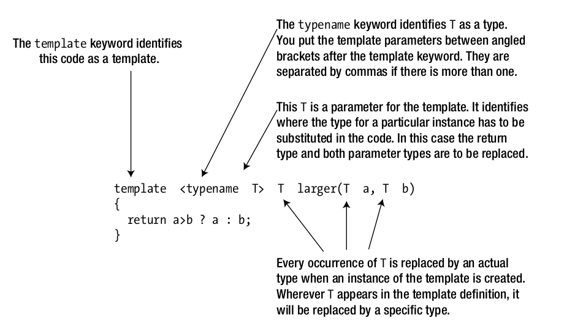

### Function templates

Notes:

1. A function template is a parameterized recipe used by the compiler to generate
overloaded functions.
2. The parameters in a function template can be type parameters or nontype
parameters. The compiler creates an instance of a function template for each
function call that corresponds to a unique set of template parameter arguments.
3. A function template can be overloaded with other functions or function templates
4. Both auto and decltype(auto) can be used to let the compiler deduce the return
type of a function. This is particularly powerful in the context of templates because
their return type may depend on the value of one or more template type arguments.